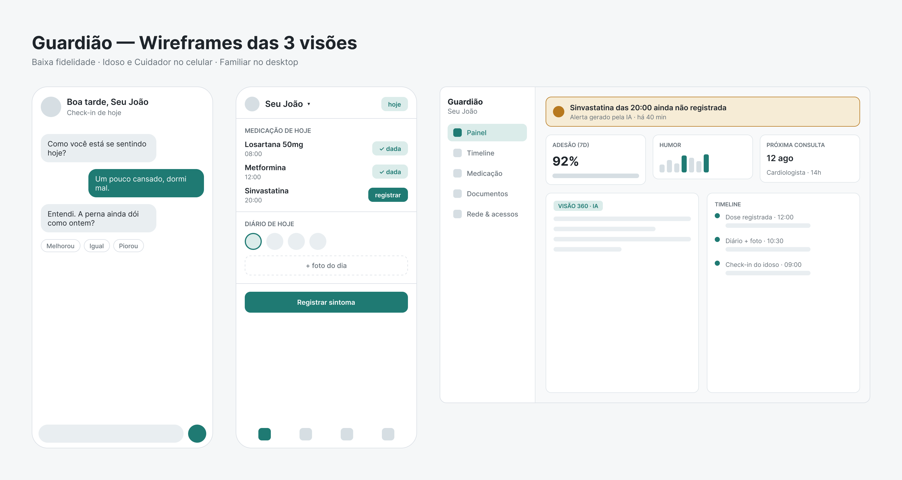
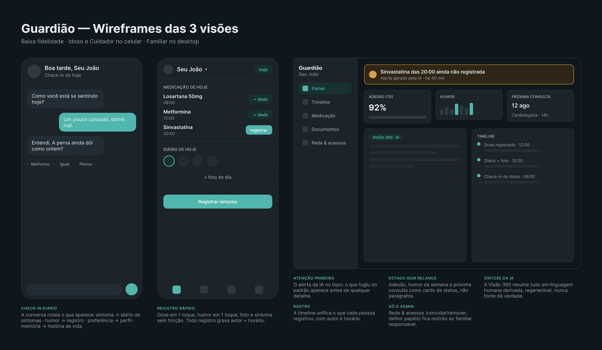

# 🛡️ Guardião


[](https://guardiao-smoky.vercel.app)

Um defensor digital para a velhice: uma plataforma de coordenação de cuidado do idoso com apoio de IA, que centraliza os dados de saúde e rotina, dá transparência ao familiar responsável e preserva a dignidade, as preferências e a vontade da pessoa idosa.

> Projeto Supervisionado de Extensão · INFNET · Engenharia de Software · Prof. Ricardo Frohlich da Silva

## Links

- 🌐 Aplicação no ar: https://guardiao-smoky.vercel.app
- 🎨 Wireframes (Figma): https://www.figma.com/design/3j2vkqR72G4LJr4CKZDhFa
- 🗂️ Planejamento e timesheet (Notion): https://app.notion.com/p/3b05307df3558154a1a4ec358fa8c919
- 💻 Repositório: https://github.com/LuisaHering/guardiao

## Sobre o projeto

O cuidado de idosos costuma ser fragmentado: as informações ficam espalhadas entre cadernos, grupos de mensagem e prontuários de clínicas diferentes, e o familiar que não está presente todo dia tem dificuldade de acompanhar e de confiar que a vontade da pessoa está sendo respeitada. O Guardião reúne tudo num lugar só, quem cuida registra o dia a dia, o familiar acompanha à distância, e a IA sintetiza uma visão sempre atualizada. A IA atua como assistente (organiza, resume, alerta), nunca como decisora.

**Cliente e beneficiário:** uma família real. Meu avô é o idoso (sujeito dos dados), a cuidadora dele registra o dia a dia, e eu sou a familiar responsável (administradora).

## Status (Semana 2 de 18)

| Fase | Foco | Status |
|------|------|--------|
| P0 | Fundações, modelagem, repositório e deploy | ✅ Concluída |
| P1 | Autenticação, papéis e funcionalidades núcleo | ⏳ A seguir |
| P2 | IA, documentos e visão 360 | ⏳ A seguir |
| P3 | Dashboard, identidade e loop conversacional | ⏳ A seguir |
| P4 | Hardening, teste com usuário real e entrega | ⏳ A seguir |

A primeira semana foi de idealização do projeto (definição de tema, cliente e escopo). O planejamento completo, a divisão em cards e a timesheet ficam no Notion.

## Wireframes

Versão light:



Versão dark, com anotações de cada tela:



## Stack

- Next.js 16 (App Router) com TypeScript e Tailwind CSS v4
- Supabase (Postgres, autenticação e storage), a partir da fase P1
- API da Anthropic para as funcionalidades de IA
- Deploy contínuo na Vercel a cada push na `main`

## Como rodar localmente

Requisitos: Node.js 20 ou superior.

```bash
git clone https://github.com/LuisaHering/guardiao.git
cd guardiao
npm install
npm run dev
```

Depois abra http://localhost:3000 no navegador.

## Documentação

- Concepção, escopo e requisitos: [`docs/concepcao.md`](docs/concepcao.md)
- Modelagem de dados e diagrama ER: [`docs/modelagem.md`](docs/modelagem.md)
