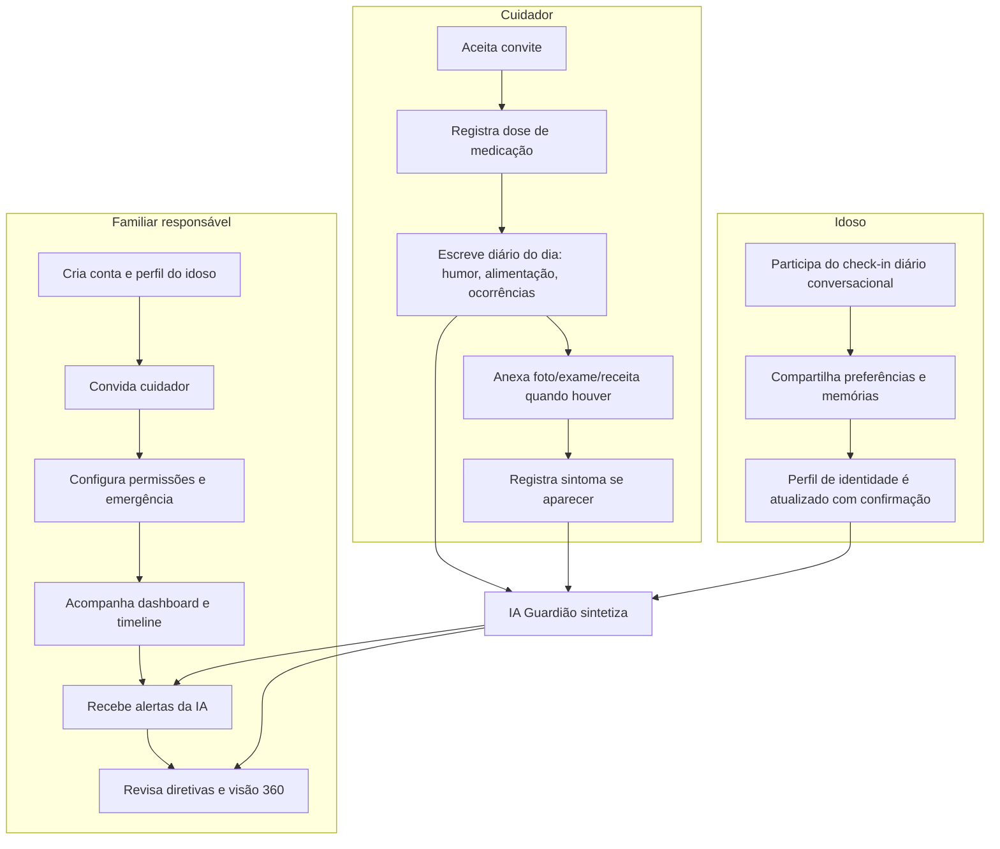

# Concepção, escopo e requisitos — Guardião

> Card #1 (GRD-1) · Fase P0 · Semana 1 · 7h (Planej 2,5 · Pesquisa 2 · Design 1,5 · Doc 1)
> Autora: Luísa · Projeto Supervisionado de Extensão (INFNET)

## 1. Problema

O Brasil está envelhecendo rapidamente e o cuidado de idosos costuma ser **fragmentado**:

- Informações de saúde, medicação e rotina ficam espalhadas entre cadernos, grupos de WhatsApp, memória de quem cuida no dia a dia e prontuários de clínicas diferentes.
- Familiares que não estão presencialmente por perto (comum em famílias com rede de apoio reduzida) têm dificuldade de acompanhar o que está acontecendo e de confiar que a vontade do idoso está sendo respeitada.
- Não existe um lugar único que preserve as **preferências e a identidade** da pessoa idosa (como quer ser tratada, o que gosta, o que não gosta) — informação que se perde exatamente quando mais importa, quando a pessoa não consegue mais comunicá-la.
- Documentos importantes (diretivas antecipadas de vontade, contatos de emergência, lista de medicações) raramente estão organizados e acessíveis no momento de uma emergência.

## 2. Solução proposta

O **Guardião** é uma plataforma web de coordenação de cuidado do idoso com apoio de IA. Centraliza os dados de saúde e rotina, permite que quem cuida registre o dia a dia, dá ao familiar responsável uma visão consolidada e usa IA como **assistente** — nunca como decisora — para sintetizar informação, transcrever consultas, extrair dados de receitas/exames e ajudar a preservar a identidade e as preferências do idoso através de conversas.

Este documento cobre o **MVP do semestre**: a fundação real e funcional da visão de longo prazo (detalhada na página-mestre do projeto no Notion), não a visão completa.

## 3. Personas

### Idoso — sujeito dos dados
Pessoa idosa cujos dados de saúde, rotina e preferências estão sendo registrados. Pode ou não interagir diretamente com o sistema, dependendo de sua capacidade e disposição. Quando participa, o faz principalmente através do **check-in conversacional** — mais natural do que preencher formulários.
**Necessidade central:** ter sua dignidade, preferências e vontade preservadas e respeitadas mesmo quando não puder mais expressá-las.

### Cuidador — quem está no dia a dia
Pessoa (familiar ou profissional) que está fisicamente presente com o idoso na maior parte do tempo: dá remédio, acompanha consultas, percebe mudanças de humor ou sintomas.
**Necessidade central:** um lugar rápido para registrar o que observa, sem fricção, que não dependa de "lembrar de contar depois" para o familiar responsável.

### Familiar responsável — administrador
Geralmente não está fisicamente presente todos os dias (pode morar em outra cidade), mas é quem responde legal e emocionalmente pelo idoso. Convida cuidadores, gerencia permissões, recebe alertas e consulta a visão consolidada.
**Necessidade central:** confiança e transparência à distância — saber que está tudo bem, e ser avisado quando não está.

> No MVP, as três personas já correspondem a pessoas reais: **meu avô** é o idoso, a **cuidadora dele** é a persona cuidadora, e **eu sou a familiar responsável/administradora**. Não há necessidade de engajar uma família de teste hipotética — o cliente real já está definido desde a Semana 1.

## 4. Jornada de cada papel

Os três fluxos convergem na **IA Guardião**, que lê os dados registrados por cuidador e idoso e devolve valor ao familiar em forma de síntese e alertas — o "loop" central do produto.

## 5. Escopo

### Dentro do MVP (este semestre)
Perfil do idoso · vínculo e convites · medicação e adesão · diário do cuidador · diário de sintomas · perfil de emergência com QR code · timeline unificada · transcrição/resumo de consultas · extração de receitas e exames · gráfico de tendência de biomarcadores · detecção de padrões · gerador de diretivas antecipadas (PDF) · visão 360 sintetizada por IA · alertas · dashboard do familiar · perfil de identidade/preferências/memórias · folha "como cuidar de mim" · chat conversacional e check-in diário com roteamento · permissões finas por papel.

*(Lista completa de funcionalidades e o modelo de permissões contribuir×administrar estão detalhados na página-mestre do Notion.)*

### Fora de escopo (por ora)
- Hardware dedicado (pendant, band, sensores) — a arquitetura de ingestão é desenhada para aceitar isso no futuro, mas não é construído agora.
- Equipes humanas presenciais 24/7 ou cuidadores contratados pela plataforma.
- Execução jurídica das diretivas (a plataforma **gera o documento**; formalização em cartório e validade jurídica seguem o processo já existente no Brasil — ver seção 6).
- Integração bancária real / antifraude financeira.
- Despacho real de emergência (SAMU) — o QR code expõe dados críticos para quem atender, mas não aciona serviços automaticamente.
- Blockchain e qualquer "cérebro decisório autônomo" — a IA é assistente, nunca decide por conta própria.

## 6. Benchmark de soluções existentes

| Solução | Foco | Pontos fortes | Limitações relevantes | O que o Guardião faz diferente |
|---|---|---|---|---|
| **CareZone** (descontinuado pela Walmart em jan/2023) | Guardar receitas, documentos e lista de remédios num só lugar | Simplicidade, upload de foto de receita | Fora do ar; nunca teve IA de síntese | Continua vivo (deploy próprio) e adiciona camada de IA |
| **Lotsa Helping Hands** | Coordenar voluntários (refeições, caronas, visitas) | Gratuito, bom para logística de apoio comunitário | Não cobre aspectos clínicos (medicação, sintomas, exames) | Guardião cobre o lado clínico/saúde que essas ferramentas deixam de fora |
| **Caring Village / CircleCare** (alternativas atualmente mantidas) | Organização geral de cuidado familiar | Ativas, com lembretes e compartilhamento | Voltadas ao mercado americano; não tratam diretivas antecipadas nem LGPD | Pensado desde o início para o contexto legal brasileiro |
| **Nenhuma das soluções pesquisadas** | — | — | Não gera diretivas antecipadas de vontade nem preserva "identidade/preferências" como funcionalidade central | Diretivas antecipadas e perfil de identidade são funcionalidades de primeira classe no Guardião |

**Conclusão do benchmark:** as soluções internacionais resolvem bem logística (Lotsa) ou repositório de documentos (CareZone, hoje fora do ar), mas nenhuma delas é pensada para o contexto legal brasileiro nem trata a preservação de identidade/preferências e diretivas antecipadas como núcleo do produto — é aí que o Guardião se diferencia.

Sobre diretivas antecipadas de vontade (DAV) no Brasil: são regidas pela **Resolução CFM nº 1.995/2012**; qualquer pessoa maior e capaz pode registrar quais tratamentos deseja ou não receber caso perca a capacidade de se expressar, e essa vontade **prevalece sobre a opinião de familiares**. A formalização costuma ocorrer em cartório ou no prontuário médico. O Guardião **gera o documento estruturado** (questionário → PDF) para facilitar esse registro, mas não substitui a formalização legal.

## 7. Notas de LGPD para dados de saúde

Dado de saúde é **dado sensível** pela LGPD (Lei 13.709/2018, art. 5º, II), o que exige cuidado redobrado:

- **Base legal (art. 11):** para uma plataforma privada como o Guardião — que não é um serviço de saúde formal nem autoridade sanitária — a base legal aplicável é o **consentimento específico e destacado** do titular (art. 11, I), coletado separadamente de outros consentimentos genéricos de uso do app. As hipóteses de dispensa de consentimento do art. 11, II (tutela da saúde por profissional de saúde, proteção da vida, obrigação legal, etc.) **não se aplicam** ao Guardião como produto, já que ele não presta serviço de saúde diretamente.
- **Consequência prática de design:** a tela de onboarding do familiar/cuidador precisa apresentar consentimento claro e específico para tratamento de dados de saúde do idoso (não basta um "aceito os termos" genérico).
- **Minimização e finalidade:** coletar só o que o produto usa; cada dado tem uma finalidade declarada (ex.: sintomas → detecção de padrões, nunca revenda ou publicidade).
- **Autoria e rastreabilidade:** todo registro guarda quem inseriu e quando — já previsto no modelo de dados (camada de ingestão com origem + autor). Isso também ajuda a atender ao princípio de responsabilização (accountability) da LGPD.
- **Direitos do titular:** o idoso (ou seu responsável legal, quando aplicável) precisa poder solicitar exportação e exclusão de seus dados — funcionalidade a considerar no hardening (Fase P4).
- **Segurança:** Supabase com Row Level Security (RLS) restringindo acesso por vínculo idoso↔usuário é o mecanismo técnico central para impedir acesso indevido a dado sensível — detalhado no card de hardening (P4).

**Fontes consultadas:** [LEC — LGPD e o mito do consentimento para dados de saúde](https://lec.com.br/lgpd-e-o-mito-do-consentimento-para-tratamento-dos-dados-de-saude/) · [Art. 11 da Lei 13.709/2018 — LGPD Brasil](https://lgpd-brasil.info/capitulo_02/artigo_11) · [Ministério da Saúde — LGPD](https://sisaps.saude.gov.br/sistemas/esusaps/docs/manual/LGPD/) · [AASP — Testamento Vital / DAV](https://www.aasp.org.br/espaco-aberto/testamento-vital-diretivas-antecipadas-de-vontade/) · [Caring Village — panorama de apps de cuidado 2026](https://caringvillage.com/blog/caregiver-tech/elderly-care-apps-for-families/)

## 8. Próximos passos

Este documento alimenta diretamente o **Card #2** (modelagem de dados, wireframes e scaffold), que traduz personas, jornadas e escopo em entidades de dados e telas.

---

**Definição de pronto deste card:** documento de concepção escrito ✅ · personas, jornada e escopo (dentro/fora) definidos ✅
