# Modelagem de dados — Guardião

> Card GRD-2 e GRD-40 · Fase P0
> **Revisão 2.1 (18/08/2026).** Incorpora as decisões D1 a D37, tomadas depois de o modelo
> original ser testado contra todas as features do roadmap, mais os ajustes do review externo
> (seção 6.1). Traduz as personas, jornadas e escopo do [concepcao.md](./concepcao.md) em
> entidades de dados.

## 1. Visão geral

O **idoso** é o centro do modelo: quase toda entidade referencia `idoso_id`. O acesso de cada
pessoa é mediado pela tabela **vinculo**, que alimenta as regras de segurança (RLS) no Supabase.

Quatro grupos de entidades:

1. **Identidade e acesso:** quem são as pessoas, como se ligam ao idoso, e sob qual consentimento.
2. **Registros do dia a dia:** o que é observado ou registrado.
3. **Documentos e extração:** o que entra como arquivo e vira dado estruturado.
4. **Gerado pela IA:** sínteses derivadas do resto.

Três princípios atravessam o modelo inteiro e explicam a maior parte das colunas:

- **Tempo.** O modelo não fotografa só o estado atual; guarda como se chegou nele. Vigência,
  histórico e séries são de primeira classe.
- **Proveniência.** Todo dado sabe de onde veio, quem afirmou, quem confirmou e quem editou.
- **Estado de processo.** Falhou, pendente e revogado são estados explícitos. A única exceção
  deliberada é a não-adesão de medicação, que passa a ser tratada por ausência de linha (ver 3.5).

## 2. Diagrama ER

```mermaid
erDiagram
    usuario ||--o{ vinculo : "participa de"
    idoso   ||--o{ vinculo : "é cuidado por"
    idoso   ||--o{ convite : "tem"
    idoso   ||--o{ consentimento : "é titular de"

    idoso ||--o{ contato_emergencia : tem
    idoso ||--o{ alergia : tem
    idoso ||--o{ condicao : tem
    idoso ||--o{ emergencia_token : tem

    idoso ||--o{ medicacao : tem
    medicacao ||--o{ registro_medicacao : "registra adesão em"
    idoso ||--o{ sintoma : registra
    idoso ||--o{ humor : registra
    idoso ||--o{ entrada_diario : tem
    idoso ||--o{ preferencia : tem
    idoso ||--o{ memoria : tem
    idoso ||--o{ item_pauta : tem

    idoso ||--o{ conversa : tem
    conversa ||--o{ mensagem : contém

    idoso ||--o{ consulta : tem
    idoso ||--o{ receita : tem
    receita ||--o{ medicacao : "origina"
    idoso ||--o{ exame : tem
    idoso ||--o{ analito : "acumula"
    exame ||--o{ exame_resultado : contém
    analito ||--o{ exame_resultado : "é medido em"
    idoso ||--o{ diretiva : tem
    idoso ||--o{ anexo : tem

    idoso ||--o{ visao_360 : "IA gera"
    idoso ||--o{ alerta : "IA gera"
    alerta ||--o{ alerta_destinatario : "é entregue a"
    idoso ||--o{ folha_cuidado : "IA gera"

    usuario {
        uuid id PK
        text nome
        text email
        timestamptz created_at
        timestamptz updated_at
        uuid editado_por FK
        timestamptz deleted_at
    }
    idoso {
        uuid id PK
        text nome
        text como_chamar "ex: 'Seu João', não 'querido'"
        date data_nascimento
        text foto_url
        text tipo_sanguineo
        text observacoes
        timestamptz created_at
        timestamptz updated_at
        uuid editado_por FK
        timestamptz deleted_at
    }
    vinculo {
        uuid id PK
        uuid usuario_id FK
        uuid idoso_id FK
        text papel "idoso | familiar | cuidador"
        boolean admin "atributo acumulável sobre o papel"
        boolean pode_contribuir
        uuid convite_id FK "de qual convite este vínculo nasceu, se veio de um"
        timestamptz created_at
        timestamptz updated_at
        uuid editado_por FK
        timestamptz deleted_at
    }
    convite {
        uuid id PK
        uuid idoso_id FK
        text email
        text papel
        boolean admin
        text token
        uuid criado_por FK
        timestamptz expira_em
        timestamptz aceito_em
        timestamptz created_at
    }
    consentimento {
        uuid id PK
        uuid idoso_id FK "titular"
        text versao_termo
        uuid operado_por FK "se não foi o próprio titular"
        timestamptz aceito_em
        timestamptz revogado_em "nulo enquanto vigente"
        timestamptz created_at
    }
    contato_emergencia {
        uuid id PK
        uuid idoso_id FK
        text nome
        text telefone
        text relacao
        timestamptz created_at
        timestamptz updated_at
        uuid editado_por FK
        timestamptz deleted_at
    }
    alergia {
        uuid id PK
        uuid idoso_id FK
        text substancia
        text reacao
        text gravidade "leve | moderada | grave"
        uuid autor_id FK
        timestamptz created_at
        timestamptz updated_at
        uuid editado_por FK
        timestamptz deleted_at
    }
    condicao {
        uuid id PK
        uuid idoso_id FK
        text nome
        date desde
        boolean ativa
        uuid autor_id FK
        timestamptz created_at
        timestamptz updated_at
        uuid editado_por FK
        timestamptz deleted_at
    }
    emergencia_token {
        uuid id PK
        uuid idoso_id FK
        text token "opaco; só ele vai no QR"
        boolean ativo
        uuid criado_por FK
        timestamptz revogado_em
        timestamptz created_at
    }
    medicacao {
        uuid id PK
        uuid idoso_id FK
        uuid receita_id FK "opcional"
        text nome
        text dosagem
        text instrucoes
        boolean ativo
        uuid autor_id FK
        boolean confirmado
        timestamptz created_at
        timestamptz updated_at
        uuid editado_por FK
        timestamptz deleted_at
    }
    registro_medicacao {
        uuid id PK
        uuid medicacao_id FK
        date data "UNIQUE(medicacao_id, data); a linha existe só quando há registro real"
        text status "dada | nao_dada"
        text motivo "esqueceu | recusou | acabou | efeito_adverso | outro"
        text observacao
        uuid registrado_por FK
        timestamptz registrado_em
        timestamptz created_at
        timestamptz updated_at
        uuid editado_por FK
        timestamptz deleted_at
    }
    sintoma {
        uuid id PK
        uuid idoso_id FK
        uuid autor_id FK "quem afirmou"
        text descricao
        int gravidade "1-5"
        text duracao_declarada "hoje | alguns_dias | algumas_semanas | meses_ou_mais"
        text origem "manual | conversa | sensor_futuro"
        uuid origem_mensagem_id FK
        boolean confirmado
        timestamptz data
        timestamptz created_at
        timestamptz updated_at
        uuid editado_por FK
        timestamptz deleted_at
    }
    humor {
        uuid id PK
        uuid idoso_id FK
        uuid autor_id FK
        text humor
        text origem
        uuid origem_mensagem_id FK
        boolean confirmado
        timestamptz data
        timestamptz created_at
        timestamptz updated_at
        uuid editado_por FK
        timestamptz deleted_at
    }
    entrada_diario {
        uuid id PK
        uuid idoso_id FK
        uuid autor_id FK
        timestamptz data
        text alimentacao
        text ocorrencias
        text foto_url
        text origem
        boolean confirmado
        timestamptz created_at
        timestamptz updated_at
        uuid editado_por FK
        timestamptz deleted_at
    }
    consulta {
        uuid id PK
        uuid idoso_id FK
        timestamptz data
        text medico
        text especialidade
        text audio_url
        text status_processamento "pendente | processando | concluido | falhou"
        text transcricao "IA"
        text resumo "IA"
        uuid autor_id FK
        timestamptz created_at
        timestamptz updated_at
        uuid editado_por FK
        timestamptz deleted_at
    }
    receita {
        uuid id PK
        uuid idoso_id FK
        text medico
        date data
        text arquivo_url
        text status_processamento
        uuid autor_id FK
        timestamptz created_at
        timestamptz updated_at
        uuid editado_por FK
        timestamptz deleted_at
    }
    exame {
        uuid id PK
        uuid idoso_id FK
        text tipo
        text laboratorio
        timestamptz data
        text arquivo_url
        uuid confirmado_por FK "obrigatório: sem isso o exame não existe"
        timestamptz confirmado_em
        uuid autor_id FK
        timestamptz created_at
        timestamptz updated_at
        uuid editado_por FK
        timestamptz deleted_at
    }
    analito {
        uuid id PK
        uuid idoso_id FK
        text nome_canonico "o do primeiro registro; histórico, não padronizado"
        text unidade_canonica
        uuid fundido_em FK "se sofreu merge, aponta para o analito vencedor"
        timestamptz created_at
    }
    exame_resultado {
        uuid id PK
        uuid exame_id FK
        uuid analito_id FK
        numeric valor "na unidade canônica do analito"
        text unidade
        numeric valor_original "como veio no papel"
        text unidade_original
        boolean convertido
        numeric ref_min "faixa do laboratório; pode ser nula"
        numeric ref_max
        boolean corrigido_manualmente
    }
    diretiva {
        uuid id PK
        uuid idoso_id FK
        jsonb respostas
        text versao_questionario
        text modo_preenchimento "titular | assistido"
        uuid assistido_por FK
        boolean titular_presente "declarado por quem digitou"
        text pdf_url
        boolean vigente
        uuid substitui_id FK
        timestamptz gerada_em
        timestamptz created_at
    }
    preferencia {
        uuid id PK
        uuid idoso_id FK
        uuid autor_id FK
        text categoria "alimentação | tratamento | rotina…"
        text chave
        text valor
        text origem
        uuid origem_mensagem_id FK
        boolean confirmado
        timestamptz created_at
        timestamptz updated_at
        uuid editado_por FK
        timestamptz deleted_at
    }
    memoria {
        uuid id PK
        uuid idoso_id FK
        uuid autor_id FK
        text titulo
        text conteudo
        text origem
        uuid origem_mensagem_id FK
        boolean confirmado
        timestamptz created_at
        timestamptz updated_at
        uuid editado_por FK
        timestamptz deleted_at
    }
    item_pauta {
        uuid id PK
        uuid idoso_id FK
        text titulo
        text detalhe
        uuid origem_mensagem_id FK "a fala que originou"
        uuid consulta_id FK "preenchido ao resolver"
        timestamptz resolvido_em
        uuid resolvido_por FK
        timestamptz created_at
        timestamptz updated_at
        uuid editado_por FK
        timestamptz deleted_at
    }
    conversa {
        uuid id PK
        uuid idoso_id FK
        uuid iniciada_por FK
        text tipo "checkin_diario | livre"
        date data_referencia
        text status "pendente | concluida"
        timestamptz created_at
    }
    mensagem {
        uuid id PK
        uuid conversa_id FK
        text papel_emissor "user | assistant"
        text conteudo
        timestamptz created_at
    }
    anexo {
        uuid id PK
        uuid idoso_id FK
        uuid autor_id FK
        text tipo "foto | pdf | audio"
        text url
        text referencia_tipo "consulta | exame | receita | diario…"
        uuid referencia_id
        timestamptz created_at
        timestamptz deleted_at
    }
    visao_360 {
        uuid id PK
        uuid idoso_id FK
        text conteudo "síntese da IA"
        timestamptz gerado_em
    }
    alerta {
        uuid id PK
        uuid idoso_id FK
        text tipo
        text severidade "info | atenção | urgente"
        text natureza "operacional | clinico"
        text referencia_tipo "evidência que o gerou"
        uuid referencia_id
        timestamptz gerado_em
    }
    alerta_destinatario {
        uuid id PK
        uuid alerta_id FK
        uuid usuario_id FK
        text texto "formulação para este destinatário, gerada na criação do alerta"
        timestamptz lido_em
    }
    folha_cuidado {
        uuid id PK
        uuid idoso_id FK
        text conteudo "'como cuidar de mim' gerada pela IA"
        timestamptz gerado_em
    }
```

## 3. Decisões-chave de modelagem

### 3.1 `vinculo`: papel e admin são eixos separados (D13, D14)

`papel` tem **três** valores (idoso, familiar, cuidador) e descreve o que a pessoa é em relação
ao idoso. **Admin é um booleano acumulável sobre qualquer papel.** Ninguém é "só admin", porque
admin não é uma relação com a pessoa, é uma responsabilidade sobre a conta.

Papel e admin têm cardinalidades diferentes: todo mundo tem exatamente um papel relacional
(ninguém é familiar e cuidador ao mesmo tempo), enquanto a marca de admin se distribui de forma
independente. Guardar as duas num campo só exigiria array ou linha duplicada, o que
inviabilizaria a constraint `UNIQUE(usuario_id, idoso_id)` e complicaria toda política de RLS.
Na interface as duas aparecem como uma coisa só ("Familiar, administradora"); a separação é de
banco, não de vocabulário.

O caso saudável é **o idoso ser admin de si mesmo**. A família assumir a administração é um
evento, não o ponto de partida.

Regras de administração: um admin adiciona e remove outro admin, sem notificação nem log (fora
do MVP). **Quem tem `papel = 'idoso'` não pode ser removido do próprio registro.** É uma condição
no delete, sem tela nem fluxo. O stamp de admin dele, esse sim, é removível como o de qualquer um:
perder admin é reversível e realista (é o que acontece quando alguém perde capacidade: a família
decide, mas a pessoa continua sendo a pessoa); sumir do registro não é.

`vinculo.convite_id` guarda de qual convite o vínculo nasceu, quando veio de um. É nulo para o
primeiro admin (que se cadastra sozinho) e serve para auditar depois "este acesso veio deste
convite, criado por fulano".

### 3.2 Camada de ingestão: `origem` + `autor_id` + FK para a mensagem (D5)

Mantida a convenção original: as tabelas de observação carregam `origem`
(`manual | conversa | sensor_futuro`) e `autor_id`, de modo que um sensor futuro seja apenas um
novo valor de `origem`.

**Acrescentado:** `origem_mensagem_id`, apontando para a `mensagem` que gerou o registro. Sem
isso, a interface não consegue mostrar *a frase de onde saiu* na hora de pedir confirmação, nem
corrigir a origem quando a extração erra.

### 3.3 `confirmado` valida a extração, não a verdade (D4)

O campo estava fazendo dois trabalhos. **"A IA entendeu certo?"** é objetivo e verificável por
quem leia a transcrição. **"Isso é verdade?"** frequentemente não tem autoridade capaz de
responder: ninguém pode confirmar que o idoso sente dor de barriga.

`confirmado` significa apenas o primeiro. E passa a existir em **todas** as tabelas que recebem
dado de IA (`medicacao`, `sintoma`, `humor`, `memoria`, `entrada_diario`, `preferencia`), e não
apenas em `preferencia`, como na revisão 1.

### 3.4 Relato subjetivo carrega quem afirmou e nunca é sobrescrito (D5)

Sintoma, humor, preferência e motivo de recusa guardam **quem afirmou**. Relatos de pessoas
diferentes coexistem como linhas distintas; ninguém sobrescreve ninguém.

Num modelo de um-fato-por-linha, vence sempre quem tem o app na mão. O idoso nunca ganharia uma
discordância, porque não vai entrar numa tela para contestar, o que contradiz a tese do projeto.
**Não há fluxo de contestação, tela de conflito nem arbitragem:** a cuidadora registra o que viu
e segue. A contradição aparece na síntese da IA. Uma formulação do tipo *"ele relata dor
abdominal após o remédio; a cuidadora não observou episódios"* é exatamente o que um médico
precisa ouvir.

Dados objetivos (valor de exame, data de consulta) não têm risco de contradição e ficam fora
dessa regra.

### 3.5 Medicação: registro por adesão, sem granularidade de horário, sem linha vazia (D1, D31, D32, D33)

`dose` com `horario_previsto` / `horario_registrado` **sai do modelo**. A cuidadora real registra
em lote, quando lembra. Materializar doses por horário mediria quando ela abriu o app, não o que
aconteceu com o idoso.

`registro_medicacao` tem no máximo **uma linha por medicação por dia**, com
`UNIQUE(medicacao_id, data)`, e **a linha só existe quando há registro real** (`dada` ou
`nao_dada`). Não há linha `nao_registrado`, e não há job diário criando linhas vazias.

A razão da mudança em relação à revisão 2: não é preciso materializar o silêncio para detectá-lo.
**Silêncio é a ausência de linha**, não uma linha marcada. Assim:

- O status tem dois valores (`dada`, `nao_dada`), e "não registrado" é simplesmente a falta de
  linha para aquele par (medicação, dia).
- A checklist do dia (quais remédios, quais já foram dados) é calculada na leitura: as medicações
  ativas em LEFT JOIN com as linhas daquela data, montada na hora em que a cuidadora abre a tela.
- O alerta de silêncio é *"faz três dias que ninguém registra"* quando não existe **nenhuma linha
  real** para o idoso nos últimos 3 dias. Nunca *"o idoso perdeu doses"*, que seria invenção: o
  sistema não sabe o que aconteceu, sabe apenas que não foi informado.

Isso tira do caminho crítico um cron diário (que, se falhar, corromperia a base de adesão) e a
explosão de linhas quase todas vazias. A série *"o remédio X foi pulado três vezes esse mês"* sai
das linhas `nao_dada` reais, sem inferência.

**Sem controle de estoque.** Estoque exigiria atualização manual a cada compra, e estoque
desatualizado produz previsão errada, pior que nenhuma. Quando `motivo = 'acabou'`, gera aviso de
reposição para o responsável.

> Limitação conhecida e aceita: como não há linha nos dias silenciosos e `medicacao.ativo` é
> booleano, o modelo não reconstrói o **histórico de vigência** de um remédio (esteve ativo em
> março? voltou depois?). Para os poucos remédios estáveis do MVP, é tolerável. Se virar
> necessário, entra uma tabela de períodos de vigência, não de volta ao job.

### 3.6 Não-adesão vira gatilho de conversa (D3, D34)

A não-adesão dispara a IA para investigar o motivo nas conversas com o idoso. O objetivo é
**entender e registrar**, nunca burlar a vontade dele nem pressioná-lo a tomar: se ele recusa,
isso é exercício de vontade, dado de primeira classe.

O motivo relatado não cabe em `medicacao` nem em `preferencia`. *"Me dá dor de barriga"* é evento
adverso relatado, nasce de uma conversa e tem destino próprio. Vira **`item_pauta`**, lista
acumulável, com a origem preservada, marcável como resolvida após a consulta.

A lista é entidade própria e não uma seção da visão 360, por duas razões. Se a fala do idoso vira
parágrafo dentro da síntese lida pelo responsável, ela foi convertida em relatório *sobre* ele;
como lista com origem, continua sendo dele, e a IA pode retomar numa conversa seguinte. E, na
prática, não há agendamento de consultas no app (o registro acontece depois, ao subir o áudio),
então não existe momento natural para gerar uma pauta por consulta. A visão 360 **referencia** a
lista em vez de duplicá-la.

### 3.7 Sintoma declara duração, não intervalo (D37)

`sintoma` ganha `duracao_declarada` em vez de um par início/fim. Ninguém volta ao app para dizer
que a dor passou; modelar o fim produziria sintomas eternamente abertos e um falso *"ele está com
dor há 40 dias"* gerado por esquecimento, o mesmo erro que a granularidade por horário produziria
na medicação.

A pergunta *"isso está acontecendo há quanto tempo?"* é respondida no momento do registro, com
informação que a pessoa tem. E quando o relato vem do check-in, a IA extrai a distinção da fala
sem esforço: *"isso me dá dor de barriga toda vez"* e *"senti dor ontem"* são clinicamente
diferentes e, sem o campo, virariam a mesma linha.

### 3.8 Exames: confirmação é etapa do envio (D6, D7)

**Exame não confirmado não existe no sistema.** Confirmar faz parte da pipeline de upload, como
aceitar os termos faz parte de criar uma conta: não aparece na timeline, não entra no gráfico,
não fica pendente. Por isso `confirmado_por` e `confirmado_em` são obrigatórios em `exame`, e não
há status de processamento nessa tabela.

Isso vale porque o valor extraído de uma foto é uma **hipótese, não um fato**: uma vírgula mal
lida vira ponto no gráfico, o gráfico vira insumo de padrão, o padrão vira alerta, e nenhuma
camada posterior percebe o erro. Com a confirmação na entrada, todo ponto de todo gráfico é
verificado por um humano, a detecção de padrão não precisa filtrar nada e o alerta não precisa
desconfiar da própria base.

A tela mostra **todos os valores de uma vez** para conferência contra o documento em mãos, com
correção inline da linha errada: um toque no caso feliz, dois no ruim. Cada correção fica marcada
(`corrigido_manualmente`) e é evidência de onde a extração falha.

**Premissa explícita:** quem sobe é quem confirma, na hora, com o exame em mãos. O modelo não
prevê "subir agora, confirmar depois" nem "outra pessoa confirma", porque isso reintroduziria o
estado pendente que D6 elimina. No cenário real (a familiar administradora sobe e confere) a
premissa se sustenta. Se um dia a cuidadora precisar subir exame sem poder conferir, isso é um
fluxo novo, não um estado a mais nesta tabela.

Arquivo de upload abandonado é limpo após 24h (D35).

### 3.9 Analito é entidade; o casamento é feito pela IA (D8, D9, D36)

O analito sai do jsonb e vira entidade própria, acumulada por idoso. **A lista existente vai no
prompt de extração:** *"use o mesmo nome se for o mesmo exame; se for novo, use o nome que veio"*.
O modelo sabe que HB é hemoglobina; o que ele não tem, processando cada exame em chamada isolada,
é acesso ao que já está no banco. Sem a lista, escreve "Hemoglobina" em março e "Hemoglobina (Hb)"
em agosto, ambas corretas, e o gráfico quebra por comparação de texto. **A pessoa não arbitra
nome.**

`nome_canonico` é o do primeiro registro, histórico e não padronizado. Falso negativo é barato:
dois analitos duplicados se resolvem com merge manual (`fundido_em`), contra um toque de
arbitragem em todo exame para sempre.

**Unidade:** se o mesmo analito vier em unidade diferente, converte para a canônica, e a conversão
**aparece explícita na tela de confirmação**. O banco guarda `valor_original` e `unidade_original`
junto com o convertido; sem isso, um fator errado corromperia a série de forma irreversível.

### 3.10 Faixa de referência pertence ao resultado (D10, D11, D12)

`ref_min` e `ref_max` ficam em `exame_resultado`, não em `analito`. Laboratórios calibram com
métodos e populações diferentes; faixa guardada no analito faria o mesmo valor ser normal ou
alterado conforme qual laboratório foi salvo por último. A banda de normalidade no gráfico muda de
altura quando o laboratório muda: feio e clinicamente correto. Faixa ausente é permitida: o ponto
fica sem banda.

Todo valor fora da faixa notifica. **Fora do MVP:** detecção de movimento dentro da faixa, que
exige histórico que não existirá até dezembro, e onde a variação entre laboratórios sozinha produz
o que pareceria tendência. O gráfico guarda `laboratorio` por ponto, então quem lê enxerga a troca
de lab; o que o modelo não captura é diferença de **método de ensaio** dentro da mesma unidade,
que produziria um degrau parecendo fisiologia. É justamente por isso que a trava do "sem tendência
dentro da faixa" é a decisão certa: o produto plota e sinaliza fora-da-faixa, não afirma tendência.

### 3.11 Emergência: o QR contém um token, nunca os dados (D16, D17, D18, D19)

O QR codifica **apenas uma URL com token opaco**. QR que codifica o conteúdo congela no dia da
impressão: troca de medicação ou alergia nova, e a pulseira passa a mentir, sem possibilidade de
correção porque a impressão é física.

Isso também resolve a contradição entre a página pública e "RLS em todas as tabelas": **não é
acesso anônimo às tabelas**. É um endpoint público que recebe o token e monta seis campos (nome,
idade, alergias, condições, medicações em uso, contatos de emergência). Sem diretivas, sem
histórico, sem exames. Nenhuma política de RLS é afrouxada, porque a leitura não passa por sessão
de usuário (ver contrato em 4).

`emergencia_token` **não expira por tempo**: pulseira que para de funcionar sozinha é pior que o
risco que evitaria. Mas é revogável por admin: revogar desativa e gera outro. Token revogado **não
é apagado**, para que o servidor responda *"este código não é mais válido"* em vez de erro
genérico durante uma emergência.

**Alergia vira entidade própria.** É o dado mais crítico de um perfil de emergência e não pode
depender de texto escrito num campo de observações. `condicao` acompanha, pelo mesmo motivo.

### 3.12 Notificação: destinatários múltiplos, por natureza do alerta (D15, D20)

`alerta.lido` global vira `alerta_destinatario`, com **estado de leitura por usuário** e **texto
por destinatário**: dado bruto para quem age sobre ele, formulação acionável e sem susto para o
titular.

O `texto` é gerado **na criação do alerta e persistido**, não na leitura. Gerar na leitura
significaria rodar a IA a cada abertura (custo, latência e o mesmo alerta lido diferente cada vez),
e o texto tem que refletir o estado de quando o alerta foi gerado, mesmo que o dado de origem seja
editado ou escondido depois. O `lido_em` só faz sentido contra um texto estável.

O titular recebe notificação sobre os próprios dados **por padrão**: não é permissão que a família
concede; sob a LGPD ele é o titular, e a administração governa o acesso *dos outros*.

O cuidador recebe o que é **operacional** (silêncio de registro, alergia nova, mudança de
medicação) e não o que é **clínico**. A linha divisória é *se a informação muda o que a pessoa faz
amanhã*. Por isso `alerta.natureza` é coluna: o roteamento decorre do papel mais da natureza do
alerta, e **`recebe_notificacao` não precisa ser capacidade configurável no `vinculo`**.

O alerta de silêncio vai para a cuidadora primeiro: se fosse só para o responsável, ele viraria
quem cobra a cuidadora toda vez; indo para ela, ela resolve sozinha. É a diferença entre o app ser
ferramenta dela ou instrumento de vigilância sobre ela.

### 3.13 Diretivas: modo de preenchimento, presença e imutabilidade (D21 a D24)

Cada diretiva registra **como foi produzida** (pelo próprio titular ou com assistência, e de
quem). No MVP a única forma viável é assistida; num futuro com interface por voz, o titular poderá
preencher sozinho. Como o modo muda com o tempo, ele é dado, não pressuposto. **O PDF precisa
declarar isso:** não pode sair documento com cara de declaração autônoma se quem digitou foi outra
pessoa. Juridicamente, um documento que diz "respondido por X com apoio de Y" é mais forte, não
mais fraco; o que enfraquece uma DAV é ambiguidade sobre quem falou.

`titular_presente` é **declaração de quem digita, não verificação**. Ninguém checa. Mas obriga um
ato consciente e específico, e fica registrado com data, que é como consentimento funciona na
maior parte do mundo real.

**Diretiva é imutável depois de gerada.** Mudança produz linha nova, com `vigente` e
`substitui_id`; as anteriores ficam guardadas. Numa pessoa com capacidade em declínio, a diretiva
anterior é a evidência de que a mudança foi dela e não de alguém em volta: sem histórico, ninguém
distingue *"ele mudou de ideia"* de *"alguém mudou por ele"*. Isso também resolve
`versao_questionario`: como a linha nunca muda, as respostas seguem legíveis contra o questionário
da época.

O PDF é o **artefato final**. Formalização em cartório ou registro em prontuário é
responsabilidade de quem quiser levar adiante.

### 3.14 Consentimento é entidade, e quem consente é o titular (D29)

Dado de saúde é sensível (LGPD art. 11, I) e exige consentimento **específico e destacado**,
separado do "aceito os termos" genérico. Nunca um booleano no `idoso`: o termo muda, e é preciso
saber sob qual versão a pessoa consentiu, daí `versao_termo`, `aceito_em` e `operado_por`.

Mesma lógica das diretivas: o titular consente, e havendo assistência ela fica registrada em vez
de escondida.

Consentimento também é **revogável** (a LGPD garante). `revogado_em` fica nulo enquanto vigente e
recebe carimbo quando o titular revoga. Não se apaga a linha: perder o rastro de que houve
consentimento (e de quando foi retirado) seria pior que mantê-lo. Reativar consentimento é uma
linha nova, como nas diretivas.

**Consequência de fluxo:** o titular precisa existir e ter consentido **antes de qualquer dado de
saúde entrar**, o que coloca essa tela antes do cadastro do perfil. Ela não existe nos wireframes
atuais (item de trabalho separado, não bloqueia o schema).

### 3.15 Rastreabilidade, exclusão e datas (D25, D26, D27, D30)

**`updated_at` + `editado_por` em todas as tabelas de domínio.** Rastrear quem inseriu não é
accountability: se alguém muda a gravidade de um sintoma de 2 para 5, ou apaga uma ocorrência do
diário, tem que sobrar vestígio.

**`deleted_at` em todas as tabelas.** "Excluir" na interface esconde e mantém a linha; apagar de
verdade destruiria a timeline e o insumo de alertas já gerados. Apagar fisicamente é mecanismo
distinto, disparado apenas por pedido formal de exclusão do titular. A maior parte dos "excluir" do
dia a dia é correção de registro errado, não exercício do direito da LGPD. Toda leitura filtra
`deleted_at IS NULL`.

**Todos os carimbos de tempo em `timestamptz`.** Misturar `date` com `timestamptz` deixava a
ordenação da timeline indefinida dentro do mesmo dia.

**`humor` existe em um lugar só:** a tabela. O campo duplicado em `entrada_diario` sai. A tela do
diário pode continuar perguntando humor; o valor grava na tabela.

### 3.16 `receita` como entidade (D28)

A §5 promete extração de receitas. Sem entidade própria, uma receita extraída virava linhas em
`medicacao` e o documento de origem se perdia, sem rastro de qual receita, de qual médico, de
quando. `medicacao.receita_id` preserva o vínculo. Os remédios extraídos de uma receita entram com
`confirmado = false` e só ficam `ativo` de fato depois da conferência humana, para não gerar
registro de adesão sobre remédio mal lido.

### 3.17 Anexo genérico e tabelas derivadas (mantidas da revisão 1)

`anexo` aponta para o registro dono por (`referencia_tipo`, `referencia_id`). Campos de URL
diretos cobrem o caso de 1 arquivo; `anexo` cobre o caso de vários.

`visao_360`, `alerta` e `folha_cuidado` são **sínteses**: regeráveis a partir dos dados brutos,
guardadas com `gerado_em` para exibição rápida, e nunca origem de nenhum dado.

## 4. Ponte para o Supabase

Este ER é o contrato para o schema SQL do card GRD-4.

- Chaves primárias `uuid`, geradas por `gen_random_uuid()`.
- `usuario.id` espelha `auth.users.id` do Supabase Auth.
- Timestamps `timestamptz` com `default now()`.
- `updated_at`, `editado_por` e `deleted_at` em todas as tabelas de domínio.
- RLS ligada em todas as tabelas, com política base `EXISTS (vinculo where usuario_id = auth.uid()
  and idoso_id = X and deleted_at is null)`. Ações de admin acrescentam `and admin = true`.
- **Exceção deliberada:** o perfil de emergência é servido por uma função `SECURITY DEFINER` que
  resolve o token e monta os seis campos server-side. Não passa por sessão de usuário e não
  afrouxa nenhuma política de RLS.
- `UNIQUE(usuario_id, idoso_id)` em `vinculo`.
- `UNIQUE(medicacao_id, data)` em `registro_medicacao`.
- Regra "quem tem `papel = 'idoso'` não é removível do próprio registro": trigger `BEFORE UPDATE`
  que barra o preenchimento de `deleted_at` nesse caso (não é constraint nem RLS).
- `alerta_destinatario.texto` é gravado na criação do alerta, não na leitura.
- `registro_medicacao` é materializado **sob demanda** (só quando há registro real). Não há job de
  criação de linhas. O alerta de silêncio é calculado como ausência de linha real nos últimos
  3 dias.
- Job de limpeza: arquivos de storage sem registro associado há mais de 24h.

## 5. Fora do MVP e limitações conhecidas

Fora do MVP: estoque e previsão de fim de medicamento, detecção de movimento dentro da faixa de
referência, notificação e log de mudança de administração, aprovação de dois admins para remoção,
expiração automática do token de emergência, fluxo de contestação de relatos, agendamento de
consultas.

Limitações conhecidas e aceitas: histórico de vigência de medicação (só o booleano `ativo`, ver
3.5); revogação de consentimento é registrada mas não tem re-fluxo de UI no MVP (ver 3.14);
exportação dos dados do titular (direito de acesso/portabilidade da LGPD) fica como leitura mais
serialização em app, sem entidade própria.

## 6. O que mudou da revisão 1 e por quê

A revisão 1 foi escrita numa passada só, junto com wireframes, scaffold e deploy no mesmo card.
Ela cobriu bem as relações de acesso e a estrutura de quem-registra-o-quê, e quebrava em **tempo**
e **proveniência**, as duas dimensões que só aparecem quando se pergunta "e daqui a seis meses?" e
"e quando falhar?".

O diagnóstico rodou cada feature da §5 do `concepcao.md` contra o ER e encontrou 19 lacunas. As
decisões estão registradas em `decisoes-modelagem-*.md`. Resumo do que entrou:

| # | Lacuna encontrada | Resolução |
|---|---|---|
| 1 | Adesão incalculável: dose pulada não virava linha | 3.5, registro por adesão, silêncio por ausência |
| 2 | `medicacao` sem histórico de vigência | 3.5, sem horários; limitação registrada |
| 3 | Tendência de exame inviável: nome livre em jsonb | 3.9, `analito` + `exame_resultado` |
| 4 | Extração de conversa sem rastro de origem | 3.2, `origem_mensagem_id` |
| 5 | `diretiva` sem autor nem vigência | 3.13 |
| 6 | `vinculo` binário demais; admin e familiar irmãos | 3.1 |
| 7 | `alerta.lido` global | 3.12, `alerta_destinatario` |
| 8 | Sem status de processamento | 3.8, confirmação na entrada |
| 9 | QR sem entidade e em conflito com RLS | 3.11 |
| 10 | Alergia inexistente | 3.11, entidade própria |
| 11 | `receita` inexistente | 3.16 |
| 12 | Regra 3.3 aplicada em 1 de 6 tabelas | 3.3 |
| 13 | Sem `updated_at` nem autor de edição | 3.15 |
| 14 | Consentimento inexistente | 3.14 |
| 15 | Timeline com `date` e `timestamptz` misturados | 3.15 |
| 16 | `humor` modelado em dois lugares | 3.15 |
| 17 | `sintoma` sem duração | 3.7 |
| 18 | `conversa` sem estado nem data de referência | ER, `data_referencia`, `status` |
| 19 | Padrão detectado sem onde morar; sem soft delete | 3.15, e `alerta.referencia_*` |

### 6.1 Ajustes após o review externo (revisão 2.1)

Mudanças aplicadas sobre a revisão 2, depois de refazer o teste de cobertura de forma
independente:

- **`registro_medicacao` passa a ser sob demanda.** A linha só existe quando há registro real;
  `nao_registrado` deixa de ser status e vira ausência de linha; o job diário de criação de linhas
  é removido; o alerta de silêncio é ausência de linha real nos últimos 3 dias. Motivo: não é
  preciso materializar o silêncio para detectá-lo, e o job era o ponto mais frágil da sessão
  (cron no caminho crítico da base de adesão, mais explosão de linhas vazias).
- **`consentimento.revogado_em`** acrescentado: a LGPD garante revogação, que não existia no
  modelo.
- **`vinculo.convite_id`** acrescentado: liga o vínculo ao convite que o originou, para auditoria.
- **Contratos de implementação explicitados na seção 4:** texto do `alerta_destinatario` gerado e
  persistido na criação; regra idoso-não-removível como trigger de soft-delete; endpoint de
  emergência como função `SECURITY DEFINER`; premissa do D6 (quem sobe o exame confirma na hora).
- **Limitações registradas** na seção 5: vigência de medicação, re-fluxo de revogação de
  consentimento, exportação de dados.

---

**Status:** revisão 2.1 pronta. Contrato válido para o schema SQL do card GRD-4.
