# Modelagem de dados — Guardião

> Card #2 (GRD-2) · Fase P0 · Semana 1
> Traduz as personas, jornadas e escopo do [concepcao.md](./concepcao.md) em entidades de dados.

## 1. Visão geral

O **idoso** é o centro do modelo: quase toda entidade referencia `idoso_id`. O acesso de cada pessoa ao sistema é mediado pela tabela **vinculo** (quem pode ver/contribuir/administrar cada idoso) — é ela que vai alimentar as regras de segurança (RLS) no Supabase.

Três grupos de entidades:

1. **Identidade & acesso** — quem são as pessoas e como elas se ligam ao idoso.
2. **Registros do dia a dia** — o que é observado/registrado (medicação, sintomas, diário, consultas, exames…).
3. **Gerado pela IA** — sínteses que a IA produz a partir do resto (visão 360, alertas, folha de cuidado).

## 2. Diagrama ER

```mermaid
erDiagram
    usuario ||--o{ vinculo : "participa de"
    idoso   ||--o{ vinculo : "é cuidado por"

    idoso ||--o{ contato_emergencia : tem
    idoso ||--o{ medicacao : tem
    medicacao ||--o{ dose : "gera registros de"
    idoso ||--o{ sintoma : registra
    idoso ||--o{ humor : registra
    idoso ||--o{ entrada_diario : tem
    idoso ||--o{ consulta : tem
    idoso ||--o{ exame : tem
    idoso ||--o{ diretiva : tem
    idoso ||--o{ preferencia : tem
    idoso ||--o{ memoria : tem
    idoso ||--o{ conversa : tem
    conversa ||--o{ mensagem : contém
    idoso ||--o{ anexo : tem

    idoso ||--o{ visao_360 : "IA gera"
    idoso ||--o{ alerta : "IA gera"
    idoso ||--o{ folha_cuidado : "IA gera"

    usuario {
        uuid id PK
        text nome
        text email
        timestamptz created_at
    }
    idoso {
        uuid id PK
        text nome
        text como_chamar "ex: 'Seu João', não 'querido'"
        date data_nascimento
        text foto_url
        text condicoes
        text observacoes
        timestamptz created_at
    }
    vinculo {
        uuid id PK
        uuid usuario_id FK
        uuid idoso_id FK
        text papel "admin | familiar | cuidador | idoso"
        boolean pode_contribuir
        timestamptz created_at
    }
    contato_emergencia {
        uuid id PK
        uuid idoso_id FK
        text nome
        text telefone
        text relacao
    }
    medicacao {
        uuid id PK
        uuid idoso_id FK
        text nome
        text dosagem
        jsonb horarios "ex: ['08:00','20:00']"
        text instrucoes
        boolean ativo
        timestamptz created_at
    }
    dose {
        uuid id PK
        uuid medicacao_id FK
        uuid registrado_por FK "usuario"
        timestamptz horario_previsto
        timestamptz horario_registrado
        text status "dada | pulada | atrasada"
        text observacao
    }
    sintoma {
        uuid id PK
        uuid idoso_id FK
        uuid autor_id FK "usuario"
        text descricao
        int gravidade "1-5"
        text origem "manual | conversa | sensor_futuro"
        timestamptz data
    }
    humor {
        uuid id PK
        uuid idoso_id FK
        uuid autor_id FK "usuario"
        text humor
        text origem
        timestamptz data
    }
    entrada_diario {
        uuid id PK
        uuid idoso_id FK
        uuid autor_id FK "usuario"
        date data
        text humor
        text alimentacao
        text ocorrencias
        text foto_url
        text origem
        timestamptz created_at
    }
    consulta {
        uuid id PK
        uuid idoso_id FK
        date data
        text medico
        text especialidade
        text audio_url
        text transcricao "IA"
        text resumo "IA"
        timestamptz created_at
    }
    exame {
        uuid id PK
        uuid idoso_id FK
        text tipo
        date data
        text arquivo_url
        jsonb valores_extraidos "IA: [{nome,valor,unidade,ref}]"
        timestamptz created_at
    }
    diretiva {
        uuid id PK
        uuid idoso_id FK
        jsonb respostas "questionário"
        text pdf_url
        text status "rascunho | gerada"
        timestamptz created_at
    }
    preferencia {
        uuid id PK
        uuid idoso_id FK
        uuid autor_id FK "usuario"
        text categoria "alimentação | tratamento | rotina…"
        text chave
        text valor
        text origem
        boolean confirmado "IA extraiu → humano confirma"
        timestamptz created_at
    }
    memoria {
        uuid id PK
        uuid idoso_id FK
        uuid autor_id FK "usuario"
        text titulo
        text conteudo
        text origem
        timestamptz created_at
    }
    conversa {
        uuid id PK
        uuid idoso_id FK
        uuid iniciada_por FK "usuario"
        text tipo "checkin_diario | livre"
        timestamptz created_at
    }
    mensagem {
        uuid id PK
        uuid conversa_id FK
        text papel "user | assistant"
        text conteudo
        timestamptz created_at
    }
    anexo {
        uuid id PK
        uuid idoso_id FK
        uuid autor_id FK "usuario"
        text tipo "foto | pdf | audio"
        text url
        text referencia_tipo "consulta | exame | diario…"
        uuid referencia_id "id do registro dono"
        timestamptz created_at
    }
    visao_360 {
        uuid id PK
        uuid idoso_id FK
        text conteudo "síntese da IA"
        timestamptz gerado_em
    }
    alerta {
        uuid id PK
        uuid idoso_id FK
        text tipo
        text mensagem
        text severidade "info | atenção | urgente"
        boolean lido
        timestamptz gerado_em
    }
    folha_cuidado {
        uuid id PK
        uuid idoso_id FK
        text conteudo "'como cuidar de mim' gerada pela IA"
        timestamptz gerado_em
    }
```

## 3. Decisões-chave de modelagem

### 3.1 `vinculo` é o coração do controle de acesso
Uma pessoa (`usuario`) pode estar ligada a mais de um idoso, e um idoso tem vários vínculos (familiar, cuidadora, ele mesmo). O `papel` define o que a pessoa pode fazer; `pode_contribuir` é o toggle que o admin liga/desliga (ex.: habilitar o próprio idoso a registrar). **Toda regra de segurança (RLS) parte daqui:** "posso ver/editar os dados do idoso X se existe um vínculo meu com X".

### 3.2 Camada de ingestão = colunas `origem` + `autor_id`, não uma tabela gigante
A visão do projeto pede que "todo dado entre por uma camada única, com origem e autor marcados", abrindo caminho para wearables no futuro. Em vez de uma única tabela genérica (que bagunçaria a tipagem no Postgres), realizo isso como **convenção**: as tabelas de observação (sintoma, humor, diário, preferência, memória) carregam `origem` (`manual | conversa | sensor_futuro`) e `autor_id`. Assim, um sensor futuro é só um novo valor de `origem` — nenhuma tabela precisa ser refeita.

### 3.3 IA sempre com confirmação humana
Dados extraídos pela IA (ex.: uma `preferencia` inferida de uma conversa) entram com `confirmado = false` e só valem depois do aval de um humano. Isso evita a IA "inventar" e mantém rastreabilidade — decisão de arquitetura registrada no documento-mestre.

### 3.4 `anexo` genérico via referência polimórfica
Um anexo aponta para o registro dono por (`referencia_tipo`, `referencia_id`) — permite anexar foto/pdf/áudio a consulta, exame ou diário sem uma tabela de anexo por entidade. Campos de URL diretos (ex.: `foto_url` no diário) ficam para o caso simples de 1 arquivo; o `anexo` cobre o caso de vários.

### 3.5 Tabelas geradas pela IA são derivadas, não fonte da verdade
`visao_360`, `alerta` e `folha_cuidado` são **sínteses** — podem ser regeradas a qualquer momento a partir dos dados brutos. Guardamos a última versão gerada (com `gerado_em`) para exibição rápida, mas elas nunca são a origem de nenhum dado.

## 4. Ponte para o Supabase (Semana 2)
Este ER é o contrato para o schema SQL do Card #4. Pontos que já ficam decididos:
- Chaves primárias `uuid` (padrão Supabase, gerado por `gen_random_uuid()`).
- `usuario.id` espelha `auth.users.id` do Supabase Auth.
- RLS ligada em todas as tabelas, com política baseada em `vinculo`.
- Timestamps `timestamptz` com `default now()`.

---

**Status:** diagrama ER pronto para revisão. Wireframes e scaffold em andamento no mesmo card.
